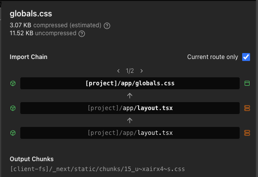
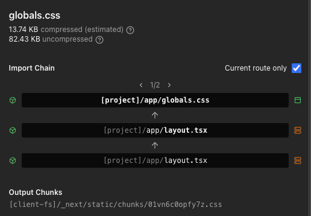

# DaisyUI + Next.js — Tradeoffs & Bundle Analysis

A practical guide to understanding what DaisyUI costs and when it's worth it.

---

## Bundle Size

### Without DaisyUI


### With DaisyUI


| | Without DaisyUI | With DaisyUI |
|---|---|---|
| CSS (gzipped) | ~3 kB | ~14 kB |
| JS | no change | no change |
| Difference | — | **+11 kB CSS** |

> DaisyUI is **CSS only** — it adds zero JavaScript to your bundle.

---

## Where the 11 kB comes from

### 1. CSS variables per theme (~4 kB)
Every `[data-theme]` block injects ~40 design tokens. With 2 themes, that's 80 variable declarations before a single component is used.

```css
[data-theme="dark"] {
  --p: ...;   /* primary */
  --s: ...;   /* secondary */
  --b1: ...;  /* base-100 */
  /* ~40 more tokens */
}
```

### 2. Base component resets (~5 kB)
DaisyUI normalizes browser defaults on every element it touches (`button`, `input`, `select`, etc.). This ships unconditionally regardless of which components you actually use.

### 3. Modifier variants (~2 kB)
Using `btn` pulls in all `btn-*` modifiers. The build can't split them per-variant, so `btn-secondary`, `btn-accent`, `btn-ghost` etc. are included even if you only use `btn-primary`.

---

## Is the cost worth it?

DaisyUI **front-loads** the CSS cost. On a small page it looks expensive — but on a real app the cost amortizes quickly.

| | Plain Tailwind | With DaisyUI |
|---|---|---|
| Small page (3–4 components) | ✅ cheaper | ❌ 11 kB overhead |
| Mid-size app (10+ components) | roughly equal | roughly equal |
| Large app (20+ component types) | ❌ grows fast | ✅ nearly free to add more |
| Design consistency across team | ❌ manual | ✅ shared vocabulary |
| Theme switching (dark/light) | ❌ build yourself | ✅ one attribute swap |

---

## When to use DaisyUI

**✅ Good fit:**
- Admin panels, dashboards, SaaS products
- Teams where consistency matters more than byte-perfect optimization
- Projects that need dark/light mode theming out of the box
- Rapid prototyping where velocity matters

**❌ Bad fit:**
- Landing pages or marketing sites (small, bespoke, few components)
- Highly custom design systems where DaisyUI's opinions fight your design
- Projects already using a full component library (shadcn/ui, Radix, MUI)

---

## DaisyUI vs the real alternatives

| | DaisyUI | shadcn/ui | Plain Tailwind |
|---|---|---|---|
| Bundle cost | fixed ~11 kB CSS | pay per component | grows with usage |
| JS added | none | some (Radix) | none |
| Theming | one attribute | manual | manual |
| Customization | CSS variables | copy & edit source | full control |
| Setup time | 2 minutes | per-component install | none |

> **shadcn/ui** is the closest competitor. It copies component source into your project so you only pay for what you use — but you lose one-line theme switching and take on maintenance of the component code.

---

## Tree-shaking

DaisyUI does tree-shake unused **components** — if you never use `carousel`, `chat`, or `timeline`, they won't appear in your build.

```
carousel  → purged ✓
chat      → purged ✓  
timeline  → purged ✓
btn       → included (used)
modal     → included (used)
```

What it **cannot** tree-shake are modifier variants within a component family, and the base theme variable blocks.

---

## Setup

```bash
npm install daisyui
```

```ts
// tailwind.config.ts
const config = {
  plugins: [require("daisyui")],
  daisyui: {
    themes: ["dark", "light"],
    defaultTheme: "dark",
  },
} satisfies Config;
```

```html
<!-- switch themes at runtime — no rebuild needed -->
<html data-theme="dark">
<html data-theme="light">
```

---

## Key insight

The honest "free" cost of DaisyUI is **~4–6 kB** (theme variables + base resets). The rest comes back to you as free component CSS as your app grows. If your app will ever have more than ~8 distinct component types, DaisyUI will likely end up costing the same or less than hand-rolled Tailwind — with far better consistency.